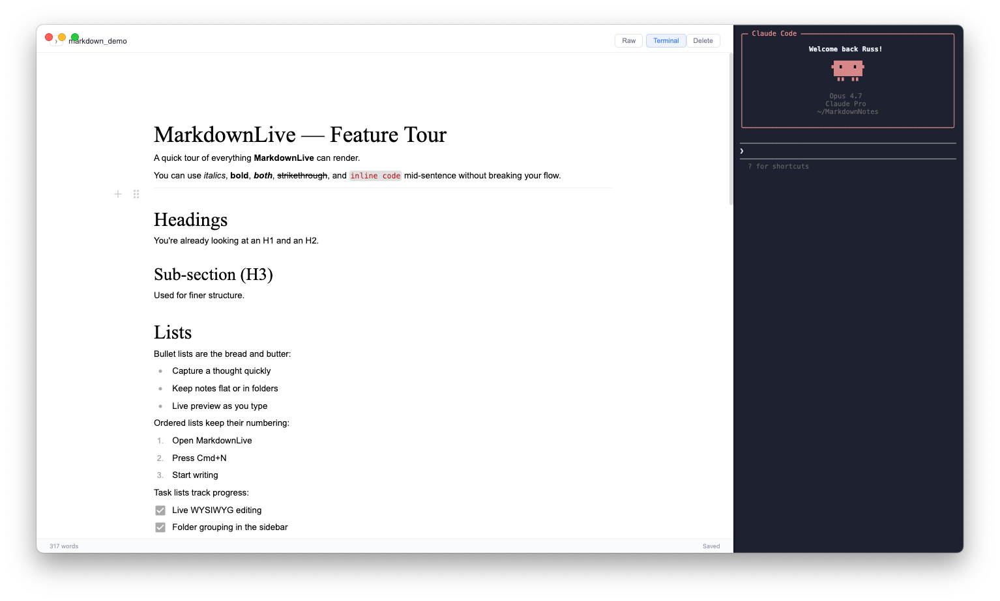

# MarkdownLive

A simple, fast markdown editor for macOS with a live WYSIWYG view, a flat working directory, and the option to drop into raw markdown whenever you need to.



## Features

- **Live WYSIWYG editing** powered by [Milkdown / Crepe](https://milkdown.dev) — type markdown and see it formatted as you go.
- **Raw markdown toggle** — flip to a plain textarea when you want to see the literal source. Mode is remembered across restarts.
- **Plain-file storage** — every note lives as a `.md` file in `~/MarkdownNotes/`. No proprietary database.
- **Folder grouping** — subfolders inside `~/MarkdownNotes/` appear as collapsible groups in the sidebar; collapsed state is remembered.
- **Live disk sync** — files added, renamed, or removed outside the app appear in (or disappear from) the sidebar within a second.
- **Drag-and-drop import** — drop one or more `.md` files onto the window to copy them into your notes.
- **Image insertion** — paste or attach an image and it's saved to `~/MarkdownNotes/images/` with a stable relative reference.
- **Collapsible sidebar** — hide the notes panel for distraction-free writing.
- **Integrated terminal** — toggle a right-hand pane (button or Cmd+`) running your default shell with `cwd` set to `~/MarkdownNotes/`. Edit notes from the CLI (e.g. with the Claude CLI) and watch them update live in the editor.
- **macOS niceties** — system spell check, autocorrect, smart quotes/dashes, and a hidden-inset title bar.
- **Autosave** — debounced save while typing, plus Cmd+S to flush immediately.

## Requirements

- macOS 10.12+
- Node.js 18+ and npm

## Run from source

```sh
git clone <this-repo-url>
cd markdown_editor
npm install
npm start
```

`npm start` builds the renderer bundle and launches the app via Electron. Notes are read from and written to `~/MarkdownNotes/` — the directory is created and seeded with a welcome note on first launch.

## Build a macOS app

```sh
npm run dist:mac
```

This produces unsigned `.dmg` installers and a runnable `.app` bundle under `release/`:

- `release/MarkdownLive-<version>-arm64.dmg` — Apple Silicon
- `release/MarkdownLive-<version>.dmg` — Intel
- `release/mac-arm64/MarkdownLive.app` — runnable directly

Because the build is unsigned, the first launch on any Mac will be blocked by Gatekeeper. Right-click the app → **Open** to bypass it; macOS will remember the choice.

If you want signed and notarised builds for distribution, you'll need an Apple Developer ID and a small additional step in the build config — not currently set up.

## Project layout

```
main.js          Electron main process: window, menu, file IPC, fs.watch
preload.js       Context-isolated bridge exposing window.api
index.html       Renderer entry point
styles.css       App styles
src/renderer.js  Renderer logic: editor, sidebar, save pipeline, drag-drop
tests/           Manual acceptance tests, organised by feature area
use_cases/       Source use-case briefs (done/ and to-do/)
```

## Tests

The `tests/` directory contains numbered manual acceptance tests in Given/When/Then form. See [tests/README.md](tests/README.md) for the index. There is no automated test suite yet.
